# SOUND_USER_MANUAL.md — La Biblia del Sonido

> Guía completa del sonido en informática: desde conceptos básicos hasta análisis avanzado.
> Cómo interpretar las 18 visualizaciones generadas por el proyecto.

---

## TABLA DE CONTENIDOS

1. [Fundamentos del Sonido](#1-fundamentos-del-sonido)
2. [Parámetros de Audio Digital](#2-parámetros-de-audio-digital)
3. [El Dominio del Tiempo: Forma de Onda](#3-el-dominio-del-tiempo-forma-de-onda)
4. [El Dominio de la Frecuencia: Espectro](#4-el-dominio-de-la-frecuencia-espectro)
5. [El Espectrograma: Cuando el Tiempo se Encuentra con la Frecuencia](#5-el-espectrograma)
6. [Pitch: La Frecuencia Fundamental (F0)](#6-pitch-la-frecuencia-fundamental)
7. [Sweep: Trayectoria Espectral](#7-sweep-trayectoria-espectral)
8. [Las 18 Visualizaciones del Proyecto](#8-las-18-visualizaciones-del-proyecto)
9. [Decibel (dB): La Escala Logarítmica](#9-decibel-dbl)
10. [Filtros y EQ](#10-filtros-y-eq)
11. [Efectos de Audio Comunes](#11-efectos-de-audio-comunes)
12. [Análisis de Voz con Bark](#12-análisis-de-voz-con-bark)
13. [Procesamiento de Audio con Voice Filter](#13-procesamiento-de-audio-con-voice-filter)
14. [Generación Paralela de Visualizaciones](#14-generación-paralela-de-visualizaciones)
15. [Comportamiento al Cerrar la Aplicación](#15-comportamiento-al-cerrar-la-aplicación)
16. [Glosario](#16-glosario)
17. [Referencias](#17-referencias)

---

## 1. Fundamentos del Sonido

### 1.1 ¿Qué es el Sonido?

El sonido es una **vibración mecánica** que se propaga como onda a través de un medio (aire, agua, sólido). Cuando un objeto vibra, comprime y descomprime las moléculas del medio creando zonas de alta presión (compresión) y baja presión (rarefacción).

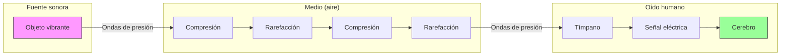

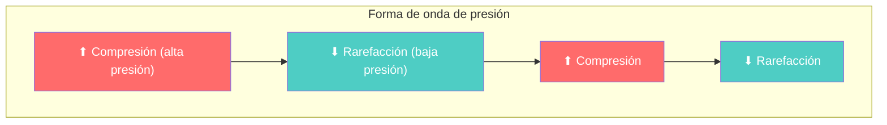

### 1.2 Propiedades del Sonido

| Propiedad | Qué mide | Unidad | Percepción |
|-----------|---------|--------|------------|
| **Amplitud** | Energía de la onda | Pascal (Pa) | Volumen (fuerte/débil) |
| **Frecuencia** | Oscilaciones por segundo | Hertz (Hz) | Tonalidad (agudo/grave) |
| **Duración** | Tiempo que dura | Segundos (s) | Longitud |
| **Timbre** | Cualidad del sonido | Adimensional | Color / Textura |

### 1.3 La Onda Sinusoidal

La onda sinusoidal es la forma de onda más simple y la base de todo el audio digital:

```
y(t) = A * sin(2π * f * t + φ)

Donde:
  A = amplitud (volumen)
  f = frecuencia (Hz)
  t = tiempo (s)
  φ = fase (ángulo inicial)
```

**Ejemplo**: Un La4 (440 Hz) es una onda sinusoidal que completa 440 ciclos por segundo.

### 1.4 Frecuencias Audibles

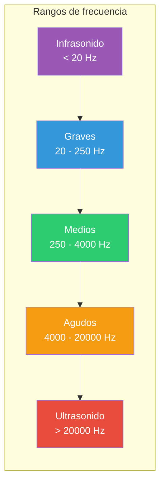

| Rango | Frecuencia | Aplicación |
|-------|-----------|------------|
| Infrasonido | < 20 Hz | Terremotos, elefantes |
| Graves | 20 - 250 Hz | Bajo, timbales, voz masculina grave |
| Medios | 250 - 4000 Hz | Voz humana, instrumentos principales |
| Agudos | 4000 - 20000 Hz | Platillos, armónicos, brillo |
| Ultrasonido | > 20000 Hz | Murciélagos, medicina (no audible) |

---

## 2. Parámetros de Audio Digital

### 2.1 Muestreo (Sampling)

El audio analógico es continuo; el digital es discreto. El **muestreo** es el proceso de capturar valores a intervalos regulares.

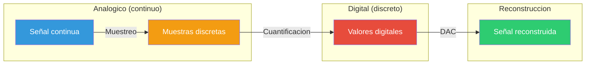

**Teorema de Nyquist-Shannon**: Para capturar correctamente una señal, la frecuencia de muestreo debe ser al menos **2 veces la frecuencia máxima** presente en la señal.

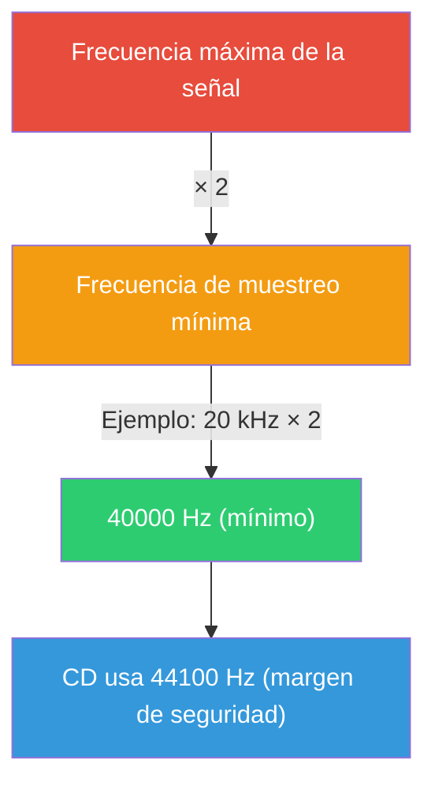

| Muestreo | Freq. máxima | Uso |
|----------|-------------|-----|
| 8000 Hz | 4000 Hz | Telefonía |
| 22050 Hz | 11025 Hz | Audio de voz |
| 44100 Hz | 22050 Hz | CD de audio |
| 48000 Hz | 24000 Hz | Video / DVD |
| 96000 Hz | 48000 Hz | Audio de alta definición |
| 192000 Hz | 96000 Hz | Producción profesional |

### 2.2 Resolución (Bit Depth)

Cada muestra se almacena con un número finito de bits:

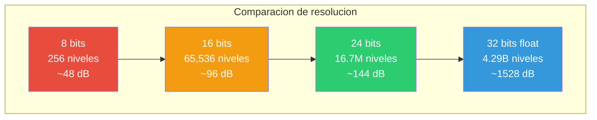

| Bits | Niveles | Rango Dinámico | Uso |
|------|---------|---------------|-----|
| 8 bits | 256 | ~48 dB | Telefonía, podcasts antiguos |
| 16 bits | 65.536 | ~96 dB | CD de audio (estándar) |
| 24 bits | 16.7M | ~144 dB | Estudio profesional |
| 32 bits float | 4.29B | ~1528 dB | Procesamiento interno |

### 2.3 Canales (Channels)

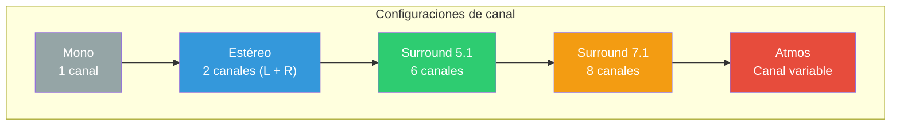

| Configuración | Descripción | Archivo |
|--------------|-------------|---------|
| **Mono** | 1 canal | Un único flujo de audio |
| **Estéreo** | 2 canales | Izquierdo + Derecho (imagen estereofónica) |
| **Surround** | 4+ canales | 5.1, 7.1, Atmos (cine) |

### 2.4 Formato de Archivo

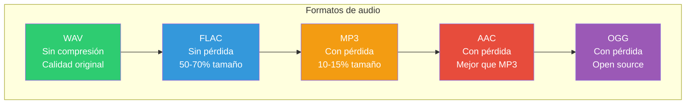

| Formato | Compresión | Calidad | Tamaño | Extensión |
|---------|-----------|---------|--------|-----------|
| **WAV** | Ninguna (PCM) | Original | Grande | .wav |
| **FLAC** | Sin pérdida | Original | 50-70% | .flac |
| **MP3** | Con pérdida | Muy buena | 10-15% | .mp3 |
| **AAC** | Con pérdida | Mejor que MP3 | 10-15% | .aac, .m4a |
| **OGG** | Con pérdida | Buena | 10-15% | .ogg |
| **WMA** | Con pérdida | Variable | 10-15% | .wma |

---

## 3. El Dominio del Tiempo: Forma de Onda

### 3.1 ¿Qué es una Forma de Onda?

La **forma de onda** (waveform) es una gráfica que muestra la **amplitud** de la señal en función del **tiempo**. Es la representación más directa del sonido.

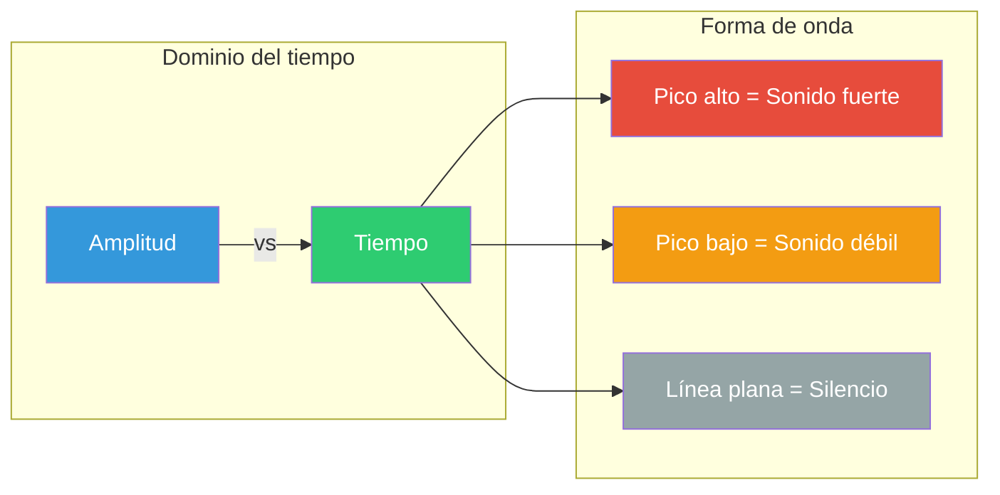

### 3.2 Cómo Interpretar la Forma de Onda

| Característica | Qué indica |
|---------------|-----------|
| **Amplitud alta** | Sonido fuerte |
| **Amplitud baja** | Sonido débil |
| **Línea plana** | Silencio |
| **Picos pronunciados** | Transitorios (percusión, consonantes) |
| **Curva suave** | Sonidos tonales (vocales, instrumentos de cuerda) |
| **Forma periódica** | Sonido con tonalidad (nota musical) |
| **Forma aleatoria** | Ruido o percusión |
| **Clipping (aplanada)** | Distorsión por exceso de nivel |

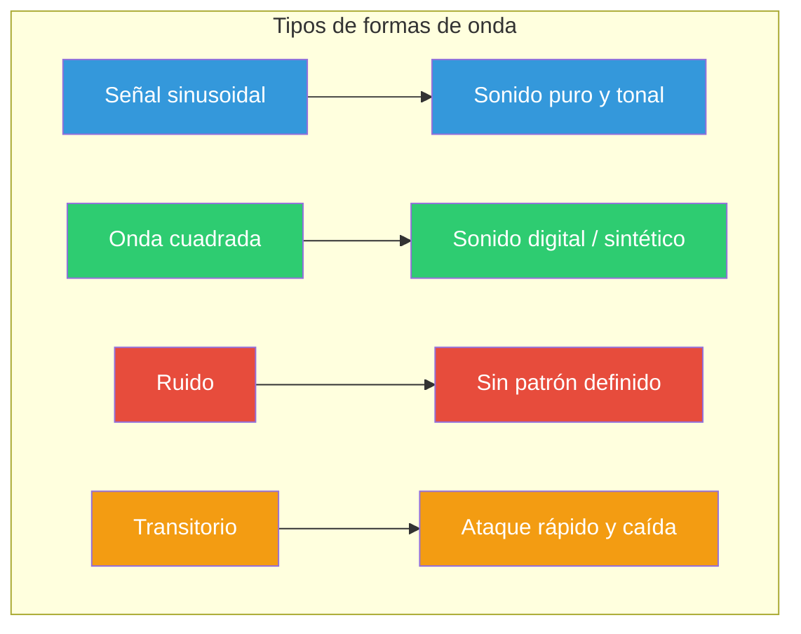

### 3.3 Propiedades Medibles

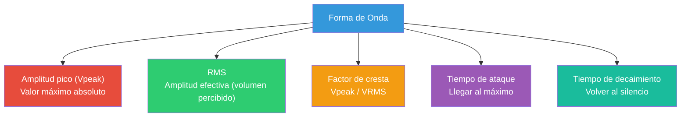

---

## 4. El Dominio de la Frecuencia: Espectro

### 4.1 Transformada de Fourier

La **Transformada de Fourier** descompone una señal compleja en sus frecuencias componentes. Es el puente entre el **dominio del tiempo** (forma de onda) y el **dominio de la frecuencia** (espectro).

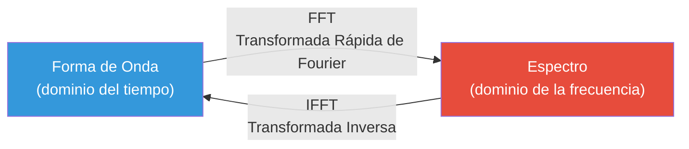

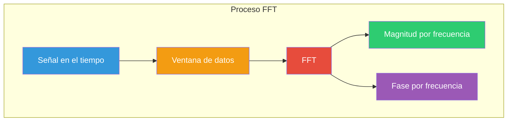

### 4.2 ¿Qué es un Espectro?

El espectro es una gráfica que muestra la **energía** de cada **frecuencia** presente en la señal.

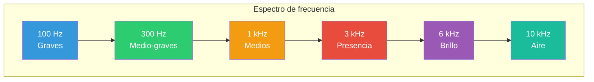

### 4.3 Cómo Interpretar el Espectro

| Forma del Espectro | Qué indica |
|-------------------|-----------|
| **Picos agudos** | Frecuencias dominantes (tonalidad) |
| **Pico a 440 Hz** | Nota La4 |
| **Picos equidistantes** | Armónicos (timbre rico) |
| **Curva suave** | Ruido o percusión |
| **Más energía a bajas** | Sonido grave, cálido |
| **Más energía a altas** | Sonido agudo, brillante |
| **Espectro vacío** | Silencio |

### 4.4 Frecuencias Armónicas

Cuando un instrumento toca una nota, no solo suena la nota base (fundamental) sino también sus **armónicos** (múltiplos enteros):

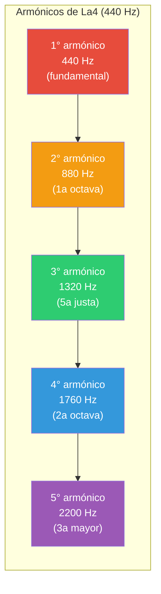

La amplitud relativa de los armónicos es lo que diferencia un violín de una flauta tocando la misma nota: el **timbre**.

---

## 5. El Espectrograma

### 5.1 ¿Qué es un Espectrograma?

El **espectrograma** es la representación más completa del sonido. Combina las dos dimensiones:

- **Eje X**: Tiempo
- **Eje Y**: Frecuencia
- **Color**: Intensidad (energía)

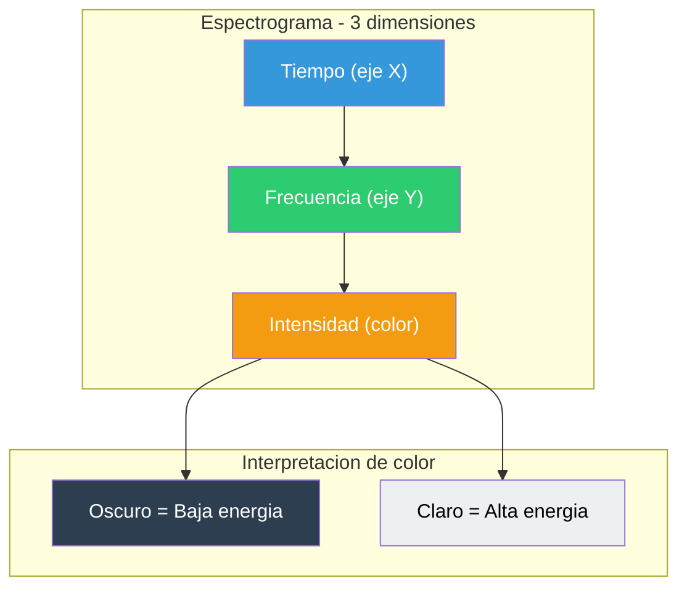

### 5.2 Cómo Interpretar el Espectrograma

| Patrón | Qué indica |
|--------|-----------|
| **Líneas horizontales** | Frecuencias que duran (tonalidad, armónicos) |
| **Líneas verticales** | Transitorios (percusión, ataques) |
| **Zona oscura** | Silencio o baja energía |
| **Zona brillante** | Alta energía |
| **Líneas paralelas** | Armónicos de un sonido tonal |
| **Bandas amplias** | Ruido (energía en muchas frecuencias) |
| **Formas curvas** | Cambios de frecuencia (portamentos, vibrato) |

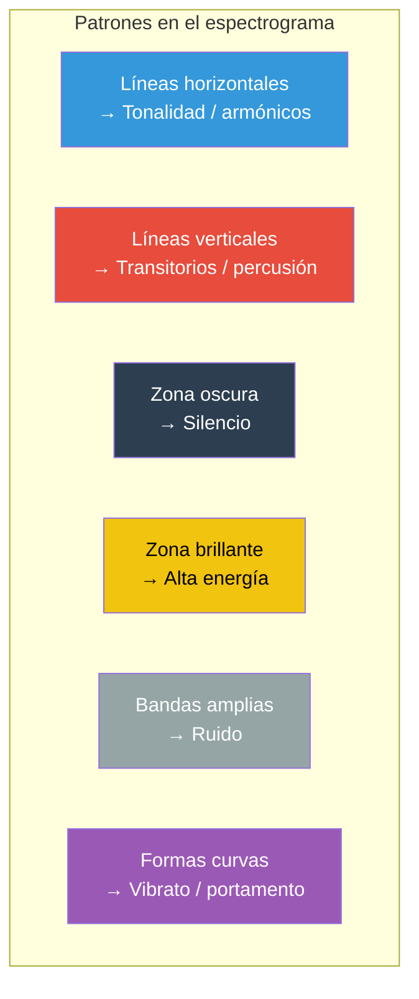

### 5.3 Espectrograma de Bark (Modelo TTS)

Cuando generas audio con Bark, el espectrograma muestra:

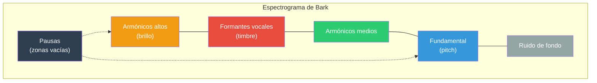

---

## 6. Pitch: La Frecuencia Fundamental (F0)

### 6.1 ¿Qué es el Pitch?

El **pitch** (tonalidad) es la frecuencia con la que nuestro cerebro interpreta un sonido como "agudo" o "grave". Técnicamente, es la **frecuencia fundamental (F0)** - la frecuencia más baja de un sonido periódico.

### 6.2 Pitch en la Voz Humana

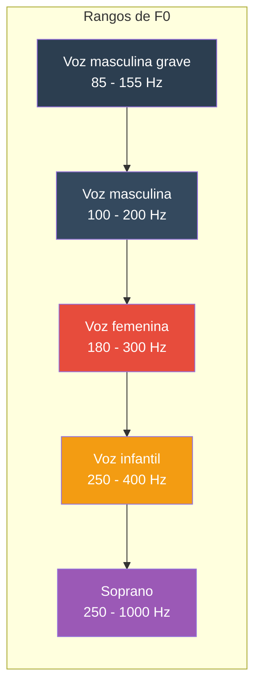

| Tipo de voz | Rango de F0 típico |
|------------|-------------------|
| Voz masculina baja | 85 - 155 Hz |
| Voz masculina | 100 - 200 Hz |
| Voz femenina | 180 - 300 Hz |
| Voz infantil | 250 - 400 Hz |
| Soprano | 250 - 1000 Hz |

### 6.3 Cómo Interpretar el Gráfico de Pitch

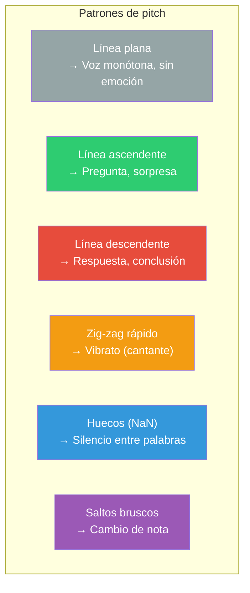

| Patrón | Significado |
|--------|-----------|
| **Línea plana** | Voz monótona, sin emoción |
| **Línea ascendente** | Pregunta, sorpresa, emoción creciente |
| **Línea descendente** | Respuesta, afirmación, conclusión |
| **Zig-zag rápido** | Vibrato (cantante) |
| **Huecos (NaN)** | Silencio, sordo (entre palabras) |
| **Saltos bruscos** | Cambio de nota o error de detección |
| **Rango amplio (100-400 Hz)** | Habla expresiva |
| **Rango estrecho (~50 Hz)** | Habla plana o monótona |

### 6.4 Medidas de Pitch

```mermaid
graph TD
    A["Medidas de Pitch"] --> B["F0 media<br/>Tonalidad base de la voz"]
    A --> C["Rango de pitch<br/>Expresividad"]
    A --> D["Jitter<br/>Irregularidad de F0"]
    A --> E["Shimmer<br/>Variación de amplitud"]

    style A fill:#3498db,color:#fff
    style B fill:#2ecc71,color:#fff
    style C fill:#f39c12,color:#fff
    style D fill:#e74c3c,color:#fff
    style E fill:#9b59b6,color:#fff
```

---

## 7. Sweep: Trayectoria Espectral

### 7.1 ¿Qué es el Sweep?

El gráfico de **sweep** muestra la **trayectoria del centroide espectral** (centro de masa del espectro) a lo largo del tiempo. Indica el "brillo" percibido del sonido.

### 7.2 Centroide Espectral

```
Centroide = Σ(frecuencia × energía) / Σ(energía)
```

Es como el "punto de equilibrio" de las frecuencias. Si más energía está en frecuencias altas, el centroide será alto (sonido brillante). Si más energía está en bajas, será bajo (sonido oscuro).

```mermaid
graph TD
    subgraph "Centroide espectral"
        A["Energía en graves<br/>→ Centroide BAJO<br/>→ Sonido OSCURO"]
        B["Energía均衡ada<br/>→ Centroide MEDIO<br/>→ Sonido NATURAL"]
        C["Energía en agudos<br/>→ Centroide ALTO<br/>→ Sonido BRILLANTE"]
    end

    style A fill:#2c3e50,color:#fff
    style B fill:#f39c12,color:#fff
    style C fill:#f1c40f,color:#000
```

### 7.3 Cómo Interpretar el Sweep

```mermaid
graph TD
    subgraph "Patrones de sweep"
        A["Línea ascendente<br/>→ Sonido más brillante"]
        B["Línea descendente<br/>→ Sonido más oscuro"]
        C["Línea plana<br/>→ Timbre constante"]
        D["Banda amplia<br/>→ Ruido (muchas freq.)"]
        E["Zona estrecha<br/>→ Sonido puro (tonal)"]
        F["Saltos bruscos<br/>→ Cambio de timbre"]
    end

    style A fill:#f39c12,color:#fff
    style B fill:#3498db,color:#fff
    style C fill:#95a5a6,color:#fff
    style D fill:#e74c3c,color:#fff
    style E fill:#2ecc71,color:#fff
    style F fill:#9b59b6,color:#fff
```

| Patrón | Qué indica |
|--------|-----------|
| **Línea ascendente** | Sonido se hace más brillante (consonante → vocal) |
| **Línea descendente** | Sonido se hace más oscuro (vocal → silencio) |
| **Línea plana** | Timbre constante |
| **Zona con banda amplia** | Sonido con muchas frecuencias (ruido) |
| **Zona estrecha** | Sonido puro (seno, tonal) |
| **Saltos bruscos** | Cambio de timbre (palabra → palabra) |

### 7.4 Sweep vs Pitch

```mermaid
graph LR
    subgraph "Diferencias clave"
        A["Pitch (F0)"] -->|"Mide"| B["Frecuencia base"]
        A -->|"Percepción"| C["Tonalidad (agudo/grave)"]
        D["Sweep (Centroide)"] -->|"Mide"| E["Centroide espectral"]
        D -->|"Percepción"| F["Timbre (brillante/oscuro)"]
    end

    style A fill:#2ecc71,color:#fff
    style B fill:#2ecc71,color:#fff
    style C fill:#2ecc71,color:#fff
    style D fill:#f39c12,color:#fff
    style E fill:#f39c12,color:#fff
    style F fill:#f39c12,color:#fff
```

| | Pitch (F0) | Sweep (Centroide) |
|-|-----------|------------------|
| **Qué mide** | Frecuencia base | Centroide espectral |
| **Percepción** | Tonalidad (agudo/grave) | Timbre (brillante/oscuro) |
| **Uso** | Notas musicales, entonación | Calidad del sonido, formantes |
| **Silencio** | NaN (hueco) | Baja energía (máscara) |

---

## 8. Las 18 Visualizaciones del Proyecto

### 8.1 Niveles de Visualización

El sistema genera visualizaciones en 3 niveles:

| Nivel | Cantidad | Archivos | Para quién |
|-------|----------|----------|------------|
| **basic** | 4 | wave, pitch, sweep, specgram | Todo usuario |
| **speech** | 11 | basic + mel, mfcc, formants, pitch_voiced, intensity, jitter_shimmer, hnr | Análisis de voz |
| **full** | 18 | speech + flatness, zcr, cqt, chroma, selfsim, lpc, spec_wb_nb | Investigación |

### 8.2 Las 4 Visualizaciones Básicas

Estas 4 son las que genera por defecto Bark CLI y Voice Filter. Son las más importantes para empezar.

#### 8.2.1 Forma de Onda (`_wave.png`)

**Qué es**: Gráfica de amplitud vs tiempo.

**Qué muestra**:
- El volumen del audio a lo largo del tiempo
- Picos altos = momentos fuertes
- Líneas planas = silencio
- Si la onda está "recortada" (aplanada arriba/abajo) = distorsión

**Para qué sirve**:
- Verificar que el audio no esté distorsionado
- Identificar palabras y pausas
- Detectar clipping (saturación)

**Ejemplo**: En "Hola, ¿cómo estás?" verías 4 bloques de amplitud separados por silencios.

#### 8.2.2 Pitch / F0 (`_pitch.png`)

**Qué es**: Frecuencia fundamental a lo largo del tiempo.

**Qué muestra**:
- La "nota" que suena en cada momento
- Línea subiendo = entonación de pregunta
- Línea bajando = afirmación o conclusión
- Huecos = silencios entre palabras

**Para qué sirve**:
- Evaluar la entonación del audio generado
- Detectar si suena natural o monótono
- Identificar errores de entonación

**Ejemplo**: "¿Cómo estás?" debería mostrar la línea subiendo al final.

#### 8.2.3 Sweep / Centroide Espectral (`_sweep.png`)

**Qué es**: Trayectoria del "centro de masa" del espectro.

**Qué muestra**:
- Si el sonido es brillante (línea alta) u oscuro (línea baja)
- Cambios de timbre entre fonemas
- Transiciones suaves vs bruscas

**Para qué sirve**:
- Evaluar la naturalidad del timbre
- Detectar artefactos (cambios bruscos)
- Comparar calidad entre generaciones

**Ejemplo**: Una vocal "a" tiene centroide más bajo que una consonante "s".

#### 8.2.4 Espectrograma (`_specgram.png`)

**Qué es**: Mapa de frecuencia + tiempo + intensidad (el más completo).

**Qué muestra**:
- Frecuencias presentes en cada momento
- Líneas horizontales = tonos (armónicos)
- Líneas verticales = golpes (consonantes)
- Zonas oscuras = silencio

**Para qué sirve**:
- Análisis visual completo del audio
- Detectar ruido, artefactos, formantes
- Evaluar calidad del modelo TTS

**Ejemplo**: Las vocales muestran bandas horizontales claras (formantes), las consonantes "s" muestran ruido en frecuencias altas.

---

### 8.3 Las 7 Visualizaciones de Voz (nivel speech)

Añadidas para análisis detallado de voz humana. Ideales para evaluar calidad de Bark.

#### 8.3.1 Espectrograma Mel (`_mel.png`)

**Qué es**: Como el espectrograma normal pero con escala **Mel** (la que percibe el oído humano).

**Diferencia con el espectrograma normal**:
- El eje Y usa escala Mel (logarítmica, como el oído)
- Las frecuencias graves tienen más "espacio" visual
- Más fiel a la percepción humana

**Para qué sirve**:
- Evaluar cómo suena el audio a un humano
- Es la entrada principal de modelos de voz (Bark usa Mel)
- Comparar con audios reales

#### 8.3.2 MFCC (`_mfcc.png`)

**Qué es**: **Mel-Frequency Cepstral Coefficients** — los 13-20 coeficientes más importantes del espectro Mel.

**Qué muestra**:
- Cada fila = un coeficiente cepstral
- Colores = valor del coeficiente en cada momento
- Patrón repetitivo =语音 estable

**Para qué sirve**:
- Identificación del hablante (cada voz tiene patrón MFCC único)
- Evaluación de clonación de voz
- Métrica principal para训练 modelos TTS

#### 8.3.3 Formantes (`_formants.png`)

**Qué es**: Tracking de las 4 resonancias principales del tracto vocal (F1-F4).

**Qué muestra**:
- F1 (rojo) = apertura de boca (vocal "a" vs "i")
- F2 (naranja) = posición de lengua
- F3 (púrpura) =Details del tracto
- F4 (azul) = characteristics del hablante

**Para qué sirve**:
- Identificar vocales específicas
- Evaluar naturalidad de la voz generada
- Comparar voces clonadas vs originales

**Ejemplo**: La vocal "a" tiene F1≈730Hz, F2≈1090Hz. La "i" tiene F1≈270Hz, F2≈2290Hz.

#### 8.3.4 Pitch + Voicing (`_pitch_voiced.png`)

**Qué es**: F0 + probabilidad de que cada frame esté "voceado" (vibrando cuerdas vocales).

**Qué muestra**:
- Panel superior: contour de F0
- Panel inferior: probabilidad 0-1 de voicing
- F0 solo aparece donde voicing > 0.5

**Para qué sirve**:
- Separar sons voceados (vocales) de no voceados (consonantes "s", "p")
- Detectar problemas devoicing
- Evaluar calidad del pitch tracking

#### 8.3.5 Intensidad (`_intensity.png`)

**Qué es**: Envolvente de energía (volumen) en escala dB.

**Qué muestra**:
- Curva de volumen a lo largo del tiempo
- Picos = sílabas fuertes
- Valles = pausas o sílabas débiles

**Para qué sirve**:
- Analizar prosodia (patrones de estrés)
- Detectar normalización incorrecta
- Evaluar dinámica del audio

#### 8.3.6 Jitter + Shimmer (`_jitter_shimmer.png`)

**Qué es**: Dos métricas de calidad vocal:
- **Jitter**: variación ciclo a ciclo de la frecuencia (F0)
- **Shimmer**: variación ciclo a ciclo de la amplitud

**Qué muestra**:
- Panel superior: Jitter (menor = más estable)
- Panel inferior: Shimmer (menor = más limpio)

**Para qué sirve**:
- Evaluar estabilidad de la voz generada
- Detectar "roughness" (rugosidad)
- Comparar calidad entre modelos

**Valores normales**:
- Jitter < 1% = voz normal
- Jitter > 3% = voz con irregularidad
- Shimmer < 3% = amplitud estable
- Shimmer > 7% = amplitud inestable

#### 8.3.7 HNR (`_hnr.png`)

**Qué es**: **Harmonic-to-Noise Ratio** — proporción entre componentes armónicos y ruido.

**Qué muestra**:
- Valor alto (> 20 dB) = voz clara, limpia
- Valor bajo (< 10 dB) = voz ruidosa, soplada

**Para qué sirve**:
- Evaluar claridad de la voz
- Detectar voz "breathy" (soplada) o "hoarse" (ronca)
- Métrica objetiva de calidad

---

### 8.4 Las 7 Visualizaciones Avanzadas (nivel full)

Para análisis técnico profundo y debugging del modelo.

#### 8.4.1 Flatness Espectral (`_flatness.png`)

**Qué es**: **Wiener entropy** — mide cuánto se parece el espectro a ruido blanco.

**Qué muestra**:
- Valor cercano a 0 = sonido tonal (nota pura)
- Valor cercano a 1 = ruido blanco

**Para qué sirve**:
- Detectar partes ruidosas vs tonales
- Identificar consonantes sordas ("s", "f", "sh")
- Evaluar si el modelo genera ruido no deseado

#### 8.4.2 Tasa de Cruce por Cero (`_zcr.png`)

**Qué es**: Cuántas veces la señal cruza por cero por segundo.

**Qué muestra**:
- Valor alto = muchas frecuencias altas (consonantes "s", "f")
- Valor bajo = sonido grave, tonal (vocales)

**Para qué sirve**:
- Separar vocales (ZCR bajo) de fricativas (ZCR alto)
- Detectar presencia de ruido de alta frecuencia

#### 8.4.3 CQT (`_cqt.png`)

**Qué es**: **Constant-Q Transform** — como un espectrograma pero con escala logarítmica (igual que las notas musicales).

**Diferencia con espectrograma normal**:
- Cada octava tiene el mismo "espacio" visual
- Más resolución en graves, menos en agudos
- Ideal para análisis musical

**Para qué sirve**:
- Analizar contenido musical del audio
- Detectar notas y acordes
- Evaluar armónicos en escala musical

#### 8.4.4 Chroma (`_chroma.png`)

**Qué es**: Energía mapeada a las 12 clases de nota (C, C#, D, ..., B).

**Qué muestra**:
- 12 filas (una por nota)
- Colores = energía en cada nota
- Patrones verticales = acordes

**Para qué sirve**:
- Analizar contenido armónico
- Detectar tónica y escala
- Evaluar si el audio es "musical"

#### 8.4.5 Self-Similarity (`_selfsim.png`)

**Qué es**: Matriz que compara cada frame con todos los demás (basada en MFCC).

**Qué muestra**:
- Diagonal = cada frame es idéntico a sí mismo
- Líneas paralelas a la diagonal = patrones repetitivos
- Zonas claras = alta similitud

**Para qué sirve**:
- Detectar repeticiones en el audio
- Identificar estructura temporal
- Evaluar consistencia del modelo

#### 8.4.6 LPC Spectrum (`_lpc.png`)

**Qué es**: **Linear Predictive Coding** — envolvente espectral suavizada.

**Qué muestra**:
- Curvas que "envuelven" el espectro real
- Picos de las curvas = formantes
- Una curva por cada frame analizado

**Para qué sirve**:
- Identificar formantes sin el "ruido" del espectro real
- Comparar timbre entre frames
- Análisis de tracto vocal

#### 8.4.7 Wideband/Narrowband (`_spec_wb_nb.png`)

**Qué es**: Dos espectrogramas lado a lado con diferentes configuraciones de ventana.

**Qué muestra**:
- **Wideband** (izquierda): buena resolución temporal, mala en frecuencia
- **Narrowband** (derecha): buena resolución en frecuencia, mala en tiempo

**Para qué sirve**:
- Wideband: ver transitorios y ataques
- Narrowband: ver armónicos individuales
- Comparar ambos para análisis completo

---

### 8.5 Flujo de Análisis Recomendado

```mermaid
graph TD
    A["1. ESPECTROGRAMA<br/>Visión global"] --> B["2. FORMA DE ONDA<br/>Dinámica y niveles"]
    B --> C["3. PITCH<br/>Entonación"]
    C --> D["4. SWEEP<br/>Timbre"]
    D --> E["5. MEL + MFCC<br/>Percepción + identidad"]
    E --> F["6. FORMANTES<br/>Calidad vocal"]
    F --> G["7. JITTER + SHIMMER<br/>Estabilidad"]

    style A fill:#e74c3c,color:#fff
    style B fill:#3498db,color:#fff
    style C fill:#2ecc71,color:#fff
    style D fill:#f39c12,color:#fff
    style E fill:#9b59b6,color:#fff
    style F fill:#3498db,color:#fff
    style G fill:#e74c3c,color:#fff
```

### 8.6 Ejemplo Práctico: Análisis de Audio de Bark

Imagina que generas: "Hola, ¿cómo estás?"

```mermaid
graph TD
    subgraph "Análisis de Hola, ¿cómo estás?"
        A["_wave.png<br/>████░░░████████░░░██████░░░████<br/>Hola  pausa  cómo estás  fin"]
        B["_pitch.png<br/>entonación de pregunta: sube al final"]
        C["_sweep.png<br/>timbre cambia con cada vocal"]
        D["_specgram.png<br/>formantes vocales: líneas horizontales"]
    end

    A --> B --> C --> D

    style A fill:#3498db,color:#fff
    style B fill:#2ecc71,color:#fff
    style C fill:#f39c12,color:#fff
    style D fill:#e74c3c,color:#fff
```

### 8.7 Diagnósticos Comunes

```mermaid
graph TD
    subgraph "Diagnósticos de audio"
        A["Audio muy débil"] -->|"Wave: amplitud pequeña"| B["Aumentar volume en Bark"]
        C["Audio distorsionado"] -->|"Wave: clipping a ±1"| D["Reducir volume"]
        E["Sonido monótono"] -->|"Pitch: línea plana"| F["Variar texto en Bark"]
        G["Ruido de fondo"] -->|"Spectrogram: zona uniforme"| H["Limpiar input o usar filtros"]
        I["Voz sin vida"] -->|"Pitch + Sweep estrechos"| J["Variar entonación"]
        K["Falta Brillo"] -->|"Sweep bajo"| L["Aumentar frecuencias altas (EQ)"]
        M["Falta Cuerpo"] -->|"Sweep alto sin bajas"| N["Aumentar graves (EQ)"]
    end

    style A fill:#e74c3c,color:#fff
    style C fill:#e74c3c,color:#fff
    style E fill:#e74c3c,color:#fff
    style G fill:#e74c3c,color:#fff
    style I fill:#e74c3c,color:#fff
    style K fill:#e74c3c,color:#fff
    style M fill:#e74c3c,color:#fff
    style B fill:#2ecc71,color:#fff
    style D fill:#2ecc71,color:#fff
    style F fill:#2ecc71,color:#fff
    style H fill:#2ecc71,color:#fff
    style J fill:#2ecc71,color:#fff
    style L fill:#2ecc71,color:#fff
    style N fill:#2ecc71,color:#fff
```

---

## 9. Decibel (dB): La Escala Logarítmica

### 9.1 ¿Por qué dB?

El oído humano percibe la intensidad de forma **logarítmica**, no lineal. El decibel es una escala logarítmica que se adapta a nuestra percepción.

```mermaid
graph LR
    subgraph "Escala de decibel"
        A["0 dB<br/>Umbral de audición"] --> B["60 dB<br/>Conversación normal"]
        B --> C["80 dB<br/>Aspiradora"]
        C --> D["100 dB<br/>Concierto rock"]
        D --> E["120 dB<br/>Umbral de dolor"]
    end

    style A fill:#2ecc71,color:#fff
    style B fill:#3498db,color:#fff
    style C fill:#f39c12,color:#fff
    style D fill:#e74c3c,color:#fff
    style E fill:#c0392b,color:#fff
```

### 9.2 Fórmula

```
L(dB) = 20 * log10(Amplitud / Amplitud_ref)
L(dB) = 10 * log10(Potencia / Potencia_ref)
```

### 9.3 Referencias

| Nivel (dB) | Fuente |
|------------|--------|
| 0 dB SPL | Umbral de audición |
| 30 dB | Respiración normal |
| 50 dB | Conversación suave |
| 60 dB | Conversación normal |
| 70 dB | Aspiradora cercana |
| 80 dB | Tráfico urbano |
| 90 dB | Camión de bomberos |
| 100 dB | Concierto rock |
| 110 dB | Sirena |
| 120 dB | Umbral de dolor |
| 140 dB | Avión en pista |

### 9.4 Regla de los 6 dB

```mermaid
graph TD
    A["Regla de los 6 dB"] --> B["+6 dB = Duplica amplitud lineal"]
    A --> C["-6 dB = Reduce amplitud a la mitad"]
    A --> D["+10 dB = Percibido como doble de fuerte"]
    A --> E["-10 dB = Percibido como mitad de fuerte"]

    style A fill:#3498db,color:#fff
    style B fill:#2ecc71,color:#fff
    style C fill:#e74c3c,color:#fff
    style D fill:#f39c12,color:#fff
    style E fill:#9b59b6,color:#fff
```

---

## 10. Filtros y EQ

### 10.1 Tipos de Filtros

```mermaid
graph TD
    subgraph "Tipos de filtros de audio"
        A["Pasa-bajas<br/>Deja freq. por debajo de fc<br/>→ Quitar ruido agudo"]
        B["Pasa-altas<br/>Deja freq. por encima de fc<br/>→ Quitar zumbido grave"]
        C["Pasa-banda<br/>Deja freq. entre fc1 y fc2<br/>→ Aislar voz"]
        D["Notch<br/>Elimina una freq. concreta<br/>→ Quitar ruido eléctrico"]
    end

    style A fill:#3498db,color:#fff
    style B fill:#2ecc71,color:#fff
    style C fill:#f39c12,color:#fff
    style D fill:#e74c3c,color:#fff
```

| Filtre | Qué hace | Ejemplo |
|--------|---------|---------|
| **Pasa-bajas** | Deja frecuencias por debajo de fc | Quitar ruido agudo |
| **Pasa-altas** | Deja frecuencias por encima de fc | Quitar zumbido grave |
| **Pasa-banda** | Deja frecuencias entre fc1 y fc2 | Aislar voz |
| **Notch** | Elimina una frecuencia concreta | Quitar ruido eléctrico (50/60 Hz) |

### 10.2 EQ (Ecualizador)

El EQ es un conjunto de filtros que ajustan la respuesta en frecuencia:

```mermaid
graph LR
    subgraph "Bandas de EQ"
        A["Graves<br/>100 Hz"] --> B["LowMid<br/>400 Hz"]
        B --> C["Medios<br/>1 kHz"]
        C --> D["HighMid<br/>2.5 kHz"]
        D --> E["Agudos<br/>6 kHz"]
    end

    style A fill:#3498db,color:#fff
    style B fill:#2ecc71,color:#fff
    style C fill:#f39c12,color:#fff
    style D fill:#e74c3c,color:#fff
    style E fill:#9b59b6,color:#fff
```

### 10.3 Guía de EQ para Voz

| Frecuencia | Qué afecta | Aumentar | Reducir |
|-----------|-----------|---------|---------|
| 80-150 Hz | Cuerpo, peso | Voz más plena | Ruido de micrófono |
| 200-400 Hz | Calidez | Voz más cálida | "Muddy" (oscuro) |
| 500-800 Hz | Cuerpo medio | Presencia | Lata |
| 1-3 kHz | Presencia | Claridad, entendimiento | Duro |
| 3-5 kHz | Brillo | Articulación | Sibilancia |
| 6-10 kHz | Aire | Frescura, transparencia | Sibilancia |
| 10-16 kHz | Aire/Brillo | Brillo | Hiss |

---

## 11. Efectos de Audio Comunes

### 11.1 Efectos Temporales

```mermaid
graph TD
    subgraph "Efectos temporales"
        A["Reverb<br/>Espacio acústico (sala, catedral)"]
        B["Delay<br/>Eco repetitivo"]
        C["Chorus<br/>Voz multiplicada (coro)"]
        D["Flanger<br/>Efecto 'jet plane'"]
        E["Phaser<br/>Efecto 'swirling'"]
    end

    style A fill:#3498db,color:#fff
    style B fill:#2ecc71,color:#fff
    style C fill:#f39c12,color:#fff
    style D fill:#e74c3c,color:#fff
    style E fill:#9b59b6,color:#fff
```

| Efecto | Parámetros | Efecto sonoro |
|--------|-----------|---------------|
| **Reverb** | Room size, decay | Espacio acústico (sala, catedral) |
| **Delay** | Tiempo, feedback | Eco repetitivo |
| **Chorus** | Depth, rate | Voz multiplicada (coro) |
| **Flanger** | Depth, rate | Efecto "jet plane" |
| **Phaser** | Depth, rate | Efecto "swirling" |

### 11.2 Efectos de Amplitud

```mermaid
graph TD
    subgraph "Efectos de amplitud"
        A["Volume<br/>Gain (0.0-2.0)"]
        B["Fade In<br/>Aparición suave"]
        C["Fade Out<br/>Desaparición suave"]
        D["Tremolo<br/>Vibración de amplitud"]
        E["Gate<br/>Cortes de silencio"]
    end

    style A fill:#3498db,color:#fff
    style B fill:#2ecc71,color:#fff
    style C fill:#f39c12,color:#fff
    style D fill:#e74c3c,color:#fff
    style E fill:#9b59b6,color:#fff
```

### 11.3 Efectos de Frecuencia

```mermaid
graph TD
    subgraph "Efectos de frecuencia"
        A["Pitch Shift<br/>Cambiar tonalidad"]
        B["Vibrato<br/>Vibración de frecuencia"]
        C["Low Pass<br/>Sonido bajo o tapado"]
        D["High Pass<br/>Sonido agudo o finito"]
        E["EQ<br/>Ajustar timbre"]
    end

    style A fill:#3498db,color:#fff
    style B fill:#2ecc71,color:#fff
    style C fill:#f39c12,color:#fff
    style D fill:#e74c3c,color:#fff
    style E fill:#9b59b6,color:#fff
```

### 11.4 Efectos de Dinámica

```mermaid
graph TD
    subgraph "Efectos de dinámica"
        A["Compressor<br/>Reducir rango dinámico"]
        B["Limiter<br/>Evitar clipping"]
        C["Normalize<br/>Máximo nivel sin clipping"]
        D["Expander<br/>Aumentar rango dinámico"]
    end

    style A fill:#3498db,color:#fff
    style B fill:#2ecc71,color:#fff
    style C fill:#f39c12,color:#fff
    style D fill:#e74c3c,color:#fff
```

### 11.5 Efectos de Distorsión

```mermaid
graph TD
    subgraph "Efectos de distorsión"
        A["Overdrive<br/>Distorsión suave (tubo)"]
        B["Distortion<br/>Distorsión fuerte"]
        C["Bitcrusher<br/>Lo-fi, efecto digital viejo"]
    end

    style A fill:#3498db,color:#fff
    style B fill:#2ecc71,color:#fff
    style C fill:#f39c12,color:#fff
```

---

## 12. Análisis de Voz con Bark

### 12.1 Pipeline de Generación

```mermaid
graph TD
    A["Texto de entrada"] --> B["BERT Tokenizer"]
    B --> C["Tokens Semánticos"]
    C --> D["GPT Text"]
    D --> E["GPT Coarse<br/>(2 codebooks)"]
    E --> F["FineGPT<br/>(8 codebooks)"]
    F --> G["EnCodec Decoder"]
    G --> H["Forma de Onda<br/>(24 kHz)"]
    H --> I["Audio Final"]

    style A fill:#3498db,color:#fff
    style B fill:#2ecc71,color:#fff
    style C fill:#f39c12,color:#fff
    style D fill:#e74c3c,color:#fff
    style E fill:#9b59b6,color:#fff
    style F fill:#1abc9c,color:#fff
    style G fill:#3498db,color:#fff
    style H fill:#2ecc71,color:#fff
    style I fill:#f39c12,color:#fff
```

### 12.2 Cómo Analizar el Audio Generado

```mermaid
graph TD
    A["Audio Bark generado"] --> B["1. Espectrograma"]
    A --> C["2. Forma de Onda"]
    A --> D["3. Pitch"]
    A --> E["4. Sweep"]
    A --> F["5. Mel + MFCC"]
    A --> G["6. Formantes"]
    A --> H["7. Jitter + Shimmer"]

    B --> B1["Formantes vocales<br/>Consonantes<br/>Pausas"]
    C --> C1["Clipping<br/>Transitorios<br/>Silencios"]
    D --> D1["Rango F0<br/>Entonación<br/>Huecos"]
    E --> E1["Centroide<br/>Transiciones<br/>Artefactos"]
    F --> F1["Percepción auditiva<br/>Identificación hablante"]
    G --> G1["Calidad vocal<br/>Estabilidad"]
    H --> H1["Rugosidad<br/>Sibilancia"]

    style A fill:#3498db,color:#fff
    style B fill:#e74c3c,color:#fff
    style C fill:#2ecc71,color:#fff
    style D fill:#f39c12,color:#fff
    style E fill:#9b59b6,color:#fff
    style F fill:#1abc9c,color:#fff
    style G fill:#3498db,color:#fff
    style H fill:#e74c3c,color:#fff
```

### 12.3 Parámetros de Bark para Mejores Resultados

| Parámetro | Valor bajo | Valor default | Valor alto | Efecto |
|-----------|-----------|---------------|-----------|--------|
| text_temp | 0.0 | 0.7 | 1.0 | Conservador ← → Diverso |
| waveform_temp | 0.0 | 0.7 | 1.0 | Predecible ← → Variado |
| fine_temp | 0.3 | 0.5 | 0.8 | Limpio ← → Natural |

---

## 13. Procesamiento de Audio con Voice Filter

### 13.1 Orden de Efectos

Los efectos se aplican en este orden:

```mermaid
graph TD
    A["Audio de Entrada"] --> B["1. Volume"]
    B --> C["2. Speed"]
    C --> D["3. Pitch"]
    D --> E["4-8. EQ<br/>(Graves, LowMid, Medios, HighMid, Agudos)"]
    E --> F["9-10. Filtros<br/>(Low Pass, High Pass)"]
    F --> G["11-15. Modulación<br/>(Chorus, Flanger, Phaser, Tremolo, Vibrato)"]
    G --> H["16-18. Distorsión<br/>(Distortion, Bitcrusher, Overdrive)"]
    H --> I["19-20. Tiempo<br/>(Reverb, Delay)"]
    I --> J["21-22. Dinámica<br/>(Compressor, Gate)"]
    J --> K["23-27. Utilidades<br/>(Fade In/Out, Normalize, Trim, Reverse)"]
    K --> L["Audio de Salida + 18 Visualizaciones"]

    style A fill:#3498db,color:#fff
    style B fill:#2ecc71,color:#fff
    style C fill:#2ecc71,color:#fff
    style D fill:#2ecc71,color:#fff
    style E fill:#f39c12,color:#fff
    style F fill:#f39c12,color:#fff
    style G fill:#e74c3c,color:#fff
    style H fill:#e74c3c,color:#fff
    style I fill:#9b59b6,color:#fff
    style J fill:#9b59b6,color:#fff
    style K fill:#1abc9c,color:#fff
    style L fill:#3498db,color:#fff
```

### 13.2 Consejos de Procesamiento

```mermaid
graph TD
    subgraph "Recipes de efectos"
        A["Voz más profesional"] --> A1["Normalize + Compressor + EQ (presencia)"]
        B["Efecto vintage"] --> B1["Bitcrusher (12 bits) + Reverb suave"]
        C["Voz de radio"] --> C1["High Pass (200 Hz) + Compressor fuerte + EQ"]
        D["Efecto espacial"] --> D1["Reverb (room) + Delay (100ms) + Chorus"]
        E["Voz más clara"] --> E1["EQ (+3dB a 3kHz) + Compressor suave"]
        F["Quitar ruido"] --> F1["Gate (-40 dB) + High Pass (100 Hz)"]
    end

    style A fill:#2ecc71,color:#fff
    style B fill:#f39c12,color:#fff
    style C fill:#e74c3c,color:#fff
    style D fill:#3498db,color:#fff
    style E fill:#9b59b6,color:#fff
    style F fill:#1abc9c,color:#fff
```

### 13.3 Generación de Imágenes

Cuando guardas audio con **Save**, Voice Filter genera automáticamente las **18 visualizaciones** en paralelo:

```mermaid
graph TD
    A["mi_audio.wav"] --> B["Nivel basic (4)"]
    A --> C["Nivel speech (+7)"]
    A --> D["Nivel full (+7)"]

    B --> B1["wave, pitch, sweep, specgram"]
    C --> C1["+ mel, mfcc, formants, pitch_voiced<br/>+ intensity, jitter_shimmer, hnr"]
    D --> D1["+ flatness, zcr, cqt, chroma<br/>+ selfsim, lpc, spec_wb_nb"]

    style A fill:#3498db,color:#fff
    style B fill:#2ecc71,color:#fff
    style C fill:#f39c12,color:#fff
    style D fill:#e74c3c,color:#fff
```

**Ubicación**: Misma carpeta que el audio guardado.

---

## 14. Generación Paralela de Visualizaciones

### 14.1 ¿Por qué paralelo?

Generar 18 imágenes con matplotlib toma ~13 segundos en secuencial. Para mejorar la experiencia de usuario, el sistema usa **procesos paralelos** (multiprocessing) para ejecutar varias gráficas a la vez.

```mermaid
graph LR
    subgraph "Secuencial"
        A["13 segundos<br/>1 gráfica a la vez"]
    end
    subgraph "Paralelo (8 cores)"
        B["~11 segundos<br/>8 gráficas a la vez"]
    end

    style A fill:#e74c3c,color:#fff
    style B fill:#2ecc71,color:#fff
```

### 14.2 Cómo funciona

1. El audio se carga en **memoria compartida** (shared memory) — todos los procesos leen el mismo dato sin copiar
2. Se lanzan **N procesos** (uno por cada core de la CPU)
3. Cada proceso genera una gráfica diferente simultáneamente
4. Un hilo principal actualiza la barra de progreso

```mermaid
graph TD
    A["Audio procesado"] --> B["Memoria compartida"]
    B --> C["Worker 1: wave"]
    B --> D["Worker 2: pitch"]
    B --> E["Worker 3: sweep"]
    B --> F["Worker 4: specgram"]
    B --> G["...hasta 18 workers"]
    C --> H["Barra de progreso"]
    D --> H
    E --> H
    F --> H
    G --> H

    style A fill:#3498db,color:#fff
    style B fill:#f39c12,color:#fff
    style C fill:#2ecc71,color:#fff
    style D fill:#2ecc71,color:#fff
    style E fill:#2ecc71,color:#fff
    style F fill:#2ecc71,color:#fff
    style G fill:#2ecc71,color:#fff
    style H fill:#9b59b6,color:#fff
```

### 14.3 Diálogo de Progreso

Al guardar audio, aparece un diálogo con:

```
┌─────────────────────────────────┐
│  Generando visualizaciones      │
│                                 │
│  Generando gráfica 5/18: mel    │
│  [████████░░░░░░░░░░░] 28%     │
│                                 │
└─────────────────────────────────┘
```

- Muestra **cuál gráfica** se está generando
- Barra de progreso con **fracción** (5/18)
- El diálogo **no bloquea** la aplicación — puedes seguir usando Voice Filter

### 14.4 Limitaciones

- En Windows, la ganancia real es ~1.2x (el overhead de crear procesos come parte del beneficio)
- En Linux/macOS sería ~2-3x (usan `fork` en vez de `spawn`)
- Matplotlib **no es thread-safe** — por eso se usan procesos, no hilos
- La ganancia principal es la **experiencia de usuario**: la app no se congela

---

## 15. Comportamiento al Cerrar la Aplicación

### 15.1 Cierre normal

Si haces clic en **Cerrar** (X) mientras no se están generando imágenes, la aplicación se cierra inmediatamente.

### 15.2 Cierre durante generación

Si haces clic en **Cerrar** mientras se están generando las 18 visualizaciones:

1. La aplicación **no se cierra** inmediatamente
2. Aparece el diálogo de progreso (si no estaba visible)
3. La generación **continúa en segundo plano**
4. Cuando termina, **la aplicación se cierra automáticamente**

```mermaid
graph TD
    A["Usuario hace clic en X"] --> B{"¿Se están generando imágenes?"}
    B -->|No| C["Cerrar inmediatamente"]
    B -->|Sí| D["Esperar a que terminen"]
    D --> E["Cerrar automáticamente"]

    style A fill:#3498db,color:#fff
    style B fill:#f39c12,color:#fff
    style C fill:#2ecc71,color:#fff
    style D fill:#e74c3c,color:#fff
    style E fill:#2ecc71,color:#fff
```

### 15.3 ¿Por qué este comportamiento?

Si la aplicación se cerrara mientras se generan imágenes:
- Los archivos PNG quedarían **a medios** (corruptos)
- Se perdería el audio que acabas de guardar
- El usuario no sabría qué pasó

El comportamiento actual **garantiza** que todas las imágenes se completen antes de cerrar.

---

## 16. Glosario

| Término | Definición |
|---------|-----------|
| **Amplitud** | Magnitud máxima de la vibración (volumen) |
| **Bit depth** | Número de bits por muestra (resolución) |
| **Centroide espectral** | Centro de masa del espectro (brillo) |
| **Chroma** | Clase de nota musical (C, C#, D, ..., B) |
| **CQT** | Constant-Q Transform — espectrograma logarítmico |
| **Clipping** | Saturación cuando la amplitud supera el máximo |
| **Compresión** | Reducción del rango dinámico |
| **dB (Decibel)** | Escala logarítmica de intensidad |
| **EnCodec** | Codificador de audio neural (usado por Bark) |
| **EQ (Ecualizador)** | Ajuste de respuesta en frecuencia |
| **Espectro** | Distribución de energía por frecuencias |
| **Espectrograma** | Mapa de frecuencia + tiempo + intensidad |
| **FFT** | Fast Fourier Transform — cálculo rápido del espectro |
| **F0 (Frecuencia Fundamental)** | Frecuencia más baja periódica (pitch) |
| **Filtro** | Circuito que modifica el contenido en frecuencia |
| **Flatness** | Wiener entropy — cuánto se parece a ruido blanco |
| **Formante** | Resonancia del tracto vocal (timbre vocal) |
| **Armónico** | Múltiplos enteros de la frecuencia base |
| **HNR** | Harmonic-to-Noise Ratio — claridad de la voz |
| **Hertz (Hz)** | Unidad de frecuencia (1 ciclo/seg) |
| **Jitter** | Variación ciclo a ciclo de la frecuencia |
| **LPC** | Linear Predictive Coding — envolvente espectral |
| **Mel** | Escala de frecuencia perceptual (como el oído) |
| **MFCC** | Mel-Frequency Cepstral Coefficients — identidad vocal |
| **Nyquist** | Freq. máxima capturable = Muestreo / 2 |
| **PCM** | Pulse Code Modulation (audio digital sin comprimir) |
| **Phase** | Ángulo de una onda sinusoidal en un instante |
| **Pitch** | Frecuencia base percibida (tonalidad) |
| **RMS** | Root Mean Square — amplitud efectiva |
| **Sample rate** | Muestras por segundo (Hz) |
| **Self-similarity** | Matriz de similitud entre frames de audio |
| **Shimmer** | Variación ciclo a ciclo de la amplitud |
| **Estéreo** | Audio con 2 canales (izquierdo + derecho) |
| **Timbre** | Cualidad que diferencia fuentes sonoras |
| **Transitorio** | Cambio rápido de amplitud (ataque, consonante) |
| **UMAP** | Uniform Manifold Approximation — proyección 2D |
| **Voicing** | Probabilidad de que un frame sea voceado (vibrando cuerdas) |
| **Waveform** | Forma de onda (amplitud vs tiempo) |
| **ZCR** | Zero Crossing Rate — tasa de cruce por cero |

---

## 17. Referencias

### Libros
- **"Digital Audio Signal Processing"** - Udo Zölzer
- **"The Technology of Computer Music"** - Miller Puckette
- **"Musimathics"** - Gareth Loy
- **"Sound Design"** - David Sonnenschein

### Recursos Online
- [Xiph.org - Digital Audio Guide](https://xiph.org/video/vidframe.shtml)
- [Sound On Sound - Synth Secrets](https://www.soundonsound.com/series/synth-secrets-sound)
- [DSP StackExchange](https://dsp.stackexchange.com/)
- [Audacity Manual](https://manual.audacityteam.org/)

### Documentos del Proyecto
- `APP_ARCHITECTURE.md` - Arquitectura de la aplicación
- `APP_TECHNICALSTACK.md` - Stack tecnológico
- `AGENTS.md` - Estructura del proyecto Bark
- `AUDIO_AND_FINETUNING.md` - Guía de ajuste fino
- `AUDIO_AND_RVC.md` - Guía RVC

---

*Última actualización: Agosto 2026*
*Autores: Eduardo P. A. (coderfast) y Colaboradores*
*Licencia: MIT*
